[](https://app.netlify.com/sites/fitness-hub/deploys)
[](https://fitnesshub.app/)

# Dokumentation der Portfolioarbeit im Fach "Plattformen und Frameworks"


## Links (alle https)

- [App](https://fitnesshub.app/)
- [Backend](https://api.timos.design:3000/)
- [API](https://api.timos.design:3000/api)
- [Jira](https://fancyfitnessplanner.atlassian.net/)
- [Repository](https://github.com/TimoScheuermann/FitnessHub)


## Gruppenmitglieder

- [Jeannine Bertrand](https://github.com/JeannineB)
- [Velichka Popp](https://github.com/Velii)
- [Jan Eger](https://github.com/egerj)
- [Nicolas Fürhaupter](https://github.com/Salocinf)
- [Moritz Jürgens (you served us well)](https://github.com/moritzjuergens)
- [Timo Scheuermann](https://github.com/TimoScheuermann)

## Inhaltsverzeichnis

- [Dokumentation der Portfolioarbeit im Fach "Plattformen und Frameworks"](#dokumentation-der-portfolioarbeit-im-fach-plattformen-und-frameworks)
  - [Links (alle https)](#links-alle-https)
  - [Gruppenmitglieder](#gruppenmitglieder)
  - [Inhaltsverzeichnis](#inhaltsverzeichnis)
- [Einführung](#einführung)
- [Unsere App](#unsere-app)
- [Vorgehen](#vorgehen)
- [Technologien](#technologien)
- [High Level Architecture](#high-level-architecture)
- [Datenbankmodell](#datenbankmodell)
  - [User](#user)
  - [Training](#training)
  - [Nutrition](#nutrition)
- [Unsere Highlights während der Entwicklung und Planung](#unsere-highlights-während-der-entwicklung-und-planung)
- [Ausblick](#ausblick)

<br>

# Einführung

Im Rahmen der Vorlesung „Plattformen und Frameworks“ durften wir uns mit verschiedenen Technologien auseinandersetzen, um unsere eigene App zu entwickeln. Die Themenfindung in unserer Gruppe verlief schnell und einfach. Da sich fitnessbegeisterte Personen in unserer Gruppe befinden, konnten diese schnell von der Idee einer Fitness- und Ernährungs-App überzeugen. Gemeinsam kamen uns immer mehr Ideen für Inhalte und Funktionen und der damals noch „FancyFitnessPlaner“ entstand in unseren Köpfen. Mittlerweile heißt unsere App „FitnessHub“, da dies besser zu den gebotenen Funktionen und Inhalten passt.
Ziel der App ist eine vollständig integrierte Live-, Virtual- und Home-Fitness-Lösung, mit der man sowohl im Studio, als auch in den eigenen vier Wänden trainieren kann. Zielgruppe unserer App sind die Menschen, die einen gesunden Lebensstil führen möchten oder dabei sind, diesen anzufangen. Die Mehrheit davon sind die sog. Millenials und die Gen-Z, was uns zur Entwicklung einer modernen, intuitiven und funktionalen UI inspiriert hat.
Im Folgenden werden einmal die Funktionen des FitnessHubs beschrieben und anschließend die angewendeten Technologien erläutert, sowie unser Vorgehen beschrieben.

# Unsere App

Zunächst einmal muss gesagt werden, dass die vollständige Nutzung der App ein Login erfordert, welchen wir über verschiedene Dienste wie Google oder Github ermöglicht haben. Somit melden sich die Mitglieder nicht direkt bei unserer App an, sondern können diese mit bereits bestehenden Konten verknüpfen und wir müssen keine persönlichen Login-Daten der Nutzer speichern. Aber auch ohne Login lassen sich die Übungen, Workouts und Rezepte, sowie die Wikis einsehen.

<p align="left">
    
    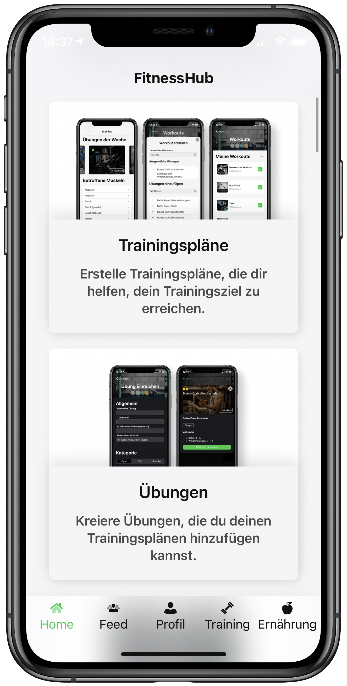
    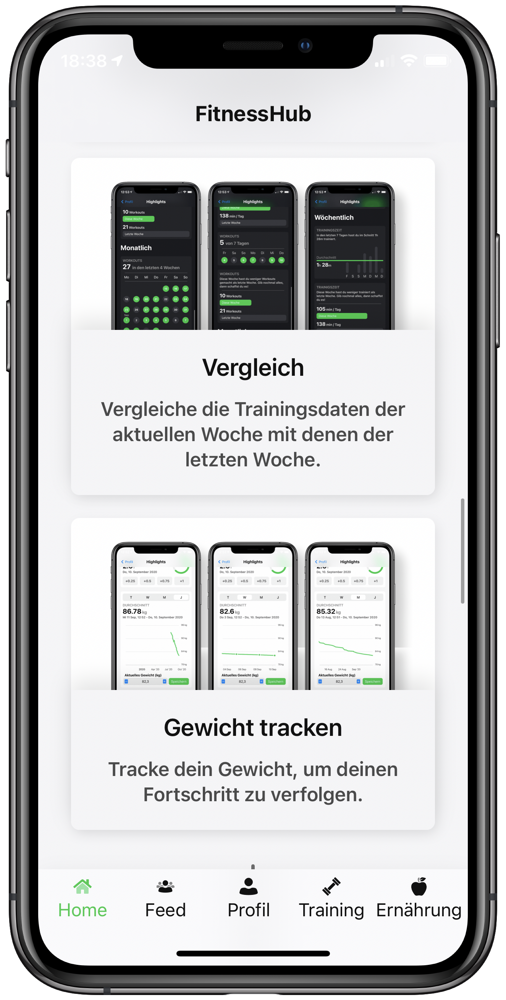
</p>

Als Mitglied der FitnessHub-Community stehen dem Benutzer verschiedene Funktionen zur Verfügung. Die Grundidee war, seine verschiedenen Trainingseinheiten planen, sowie vorgeschlagene Trainingspläne für das eigene Training nutzen zu können. Der User soll ebenfalls bei seiner Ernährung durch Rezeptvorschläge oder interessante Ernährungsfakten unterstützt werden und seine Fortschritte tracken können. Auch Freundschaften kommen in unserer App nicht zu kurz, da man andere User als Freunde hinzufügen und mit diesen über unser Chatsystem kommunizieren kann.
Unsere Startseite beinhaltet alles, was man für einen schnellen Trainingsstart und während des Trainings benötigt. Diese ist relativ minimalistisch gehalten und zeigt lediglich eine Uhr an, die sich als Timer oder Stoppuhr verwenden lässt, sowie eine Weiterleitung zum direkten Trainingsstart oder der Erstellung eines neuen Workouts.

<p align="left">
    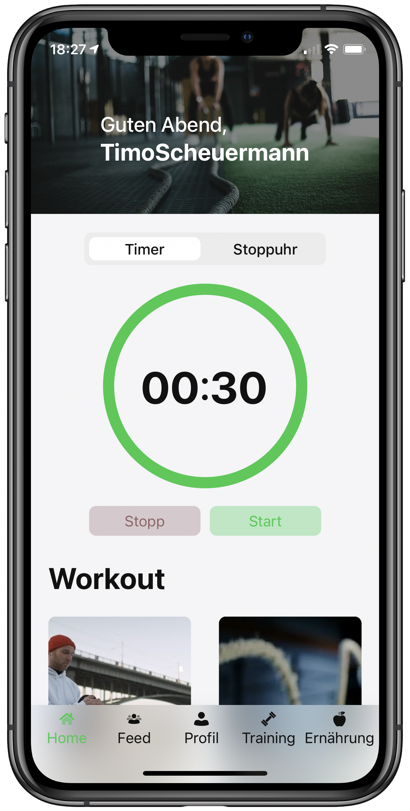
    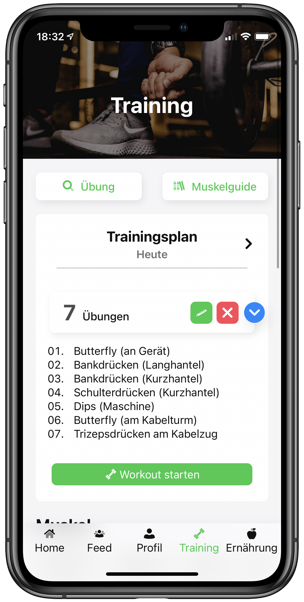
    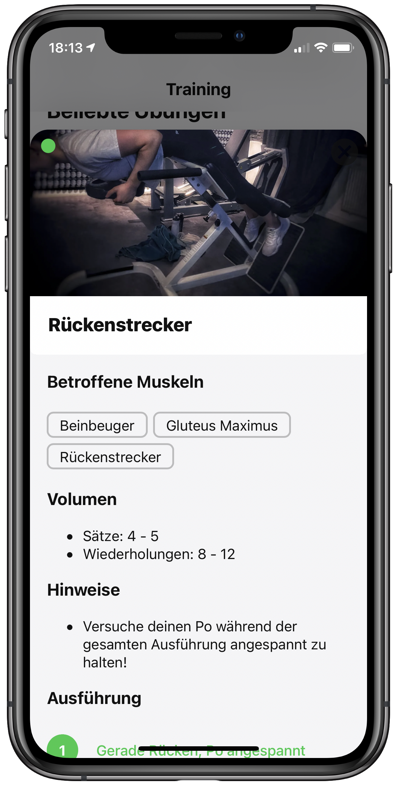
</p>

Der Trainingsreiter gibt einen Überblick über verschiedene Sportarten und Fitnessübungen. Diese lassen sich nach Muskelgruppen sortieren und durch Anklicken um genauere Informationen erweitern. Während man bei verschiedenen Sportarten den durchschnittlichen Kalorienverbrauch angezeigt bekommt, erfährt man bei Cardio-Übungen zusätzlich noch Informationen über die Wirkung der Übung, sowie eventuell eine Warnung bei besonderer Verletzungsgefahr. Die Darstellung der Kraftübungen beinhaltet zum einen die angesprochenen Muskelgruppen und die schrittweise Ausführung der Übung und zum anderen Hinweise zur Übungsvariation und dem Schwierigkeitsgrad. Ebenfalls werden im Trainingsreiter bereits angelegte und geteilte Trainingspläne aufgelistet, die einem bei jedem Training zur Verfügung stehen. Für Neulinge in Sachen Kraftsport findet sich hier ebenfalls der Muskelguide, der die Lage und Funktion der wichtigsten Muskeln kurz beschreibt.
Möchte man nun eigene Trainingspläne anlegen, gelingt einem dies über den Profilreiter. Hier lassen sich unter „Workouts & Trainingsplan“ eigene Pläne erstellen, bearbeiten und für bestimmte Tage einplanen. Auch können hier unter „Übungen“ bisher fehlende oder selbst kreierte Übungen oder Sportarten definiert und eingereicht werden. Diese werden zunächst uns als Administratoren und den eingestellten Moderatoren zur Überprüfung angezeigt und können anschließend von uns bearbeitet und freigegeben werden. Dasselbe gilt für Rezepte. Auch diese können unter „Meine Rezepte“ eingereicht werden. Um unsere Mitglieder zu motivieren, können diese verschiedene Erfolge freischalten (bspw. beim Eintragen des ersten freien Klimmzuges). Natürlich kann auch jedes Mitglied sein Gewicht tracken und kann sich dieses über „Trainingsstatistik“ in verschiedenen Zeitperioden als Graph mit zugehörigem aktuellen BMI anzeigen lassen.

<p align="left">
    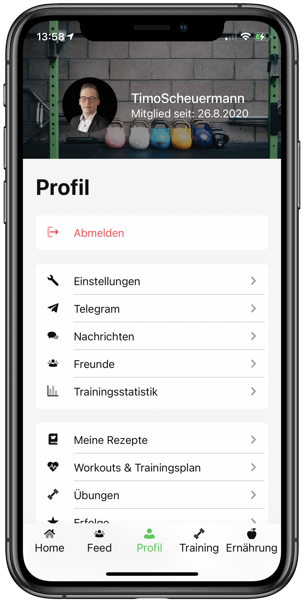
    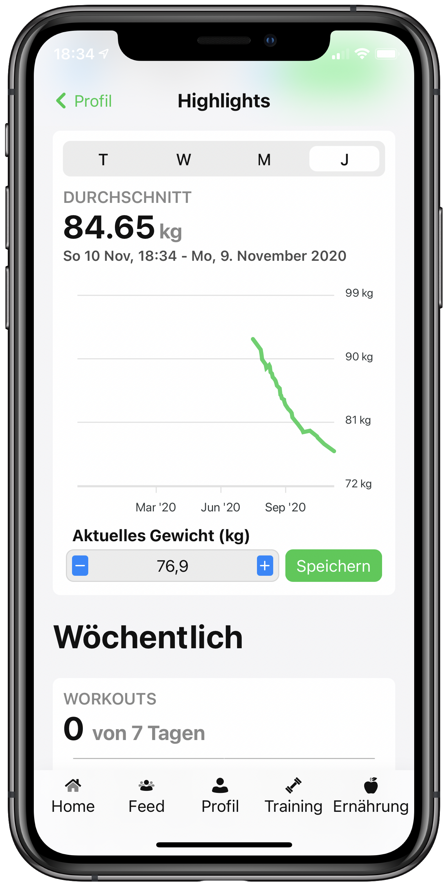
    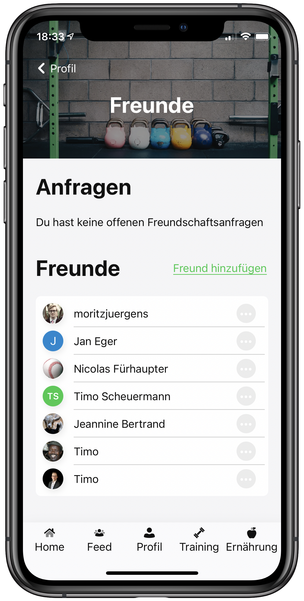
</p>

Auch das Freundschaftssystem der App ist unter Profil realisiert. Hier kann man unter „Freunde“ neue Bekanntschaften hinzufügen und einen Chat mit diesen beginnen. Alle Chats befinden sich unter „Nachrichten“ nach Aktualität und Person sortiert. Diese Rubrik ist aufgebaut wie bei vielen anderen Messengerdiensten und erlaubt zudem die Weiterleitung zu Telegram.
Der Ernährungsreiter beinhaltet zunächst einen „Trinkometer“ mit dessen Hilfe man seine Flüssigkeitszufuhr pro Tag tracken kann. Mit Hilfe eines Kreisdiagramms wird der Nutzer dazu motiviert seinen täglichen Flüssigkeitsbedarf zu decken. Außerdem befinden sich auf dieser Seite die Rezepte. Diese sind nach Kategorien wie glutenfrei, high Protein, vegan oder ähnliches sortiert. Hat der Nutzer sich für ein Rezept entschieden werden ihm eine Zutatencheckliste, die Zubereitungsanleitung, alle enthaltenen Nährwerte und weitere interessante Fakten und Tipps angezeigt. Außerdem findet man über diese Seite verschiedene Ernährungstipps, sowie eine Erklärung verschiedener Supplements.


<p align="left">
    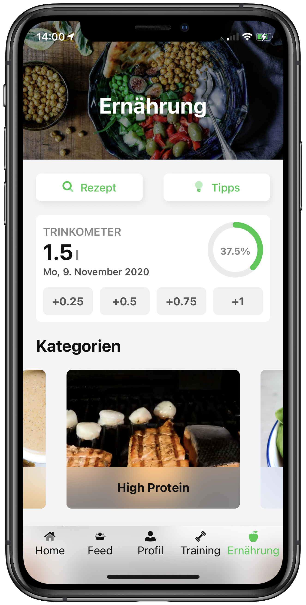
    
    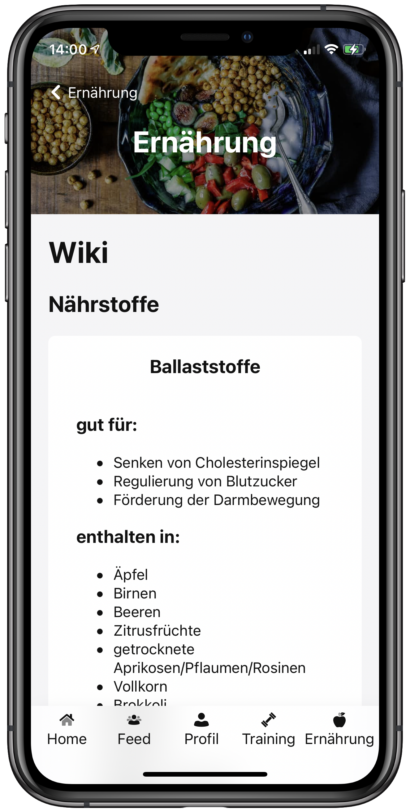
</p>

Die folgende Grafik verdeutlicht einmal die Vorteile unserer FitnessHub-App:

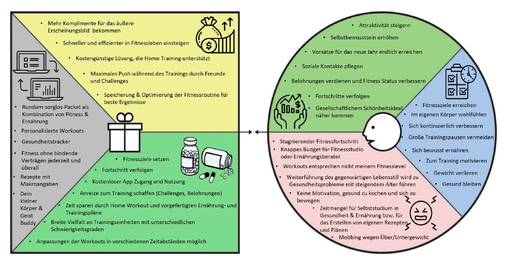

# Vorgehen

Unser gesamtes Projekt planten und organisierten wir über ein Jira-Board und führten wöchentliche Sprint-Meetings ein. Während dieser Sprintmeetings erläuterte jeder kurz, was er die vergangene Woche gemacht hat und wie er dies umsetzte. Dieses Vorgehen führte dazu, dass jeder aktiv am Projekt mitarbeitete und man permanent einen Überblick über das gesamte Projekt hatte. Außerdem wurde während diesen Meetings das weitere Vorgehen geplant, sowie Prioritäten gesetzt und verschiedene Aufgaben analysiert.
Wir teilten unsere Gruppe in drei gesonderte Teams auf, die sich jeweils um das Backend (Jan Eger, Timo Scheuermann), das Frontend (Moritz Jürgens, Nicolas Fürhaupter) und jegliche Inhalte der Seite (Velichka Popp, Jeannine Bertrand) kümmerten.

# Technologien

Eine große Herausforderung war die Auswahl optimaler Technologien für die Entwicklung unserer App. Bei der großen Vielfalt in der Entwicklerszene mussten wir unsere Auswahl einschränken, indem wir die Vor- und Nachteile der Frameworks abwägten. Durch eine ausführliche Recherche und spannende Gruppengespräche konnten wir einige Kriterien herauskristallisieren, die uns später bei der Auswahl der Technologien unterstützten. Diese sind in der unterstehenden Tabelle aufgeführt – dabei handelt es sich um eine Nutzwertanalyse, bei der die diversen Frameworks mit einer Punktezahl von 0 (= ungenügend) bis 5 (=sehr gut) bewertet wurden. Eine sehr große Rolle spielten dabei z.B. die Lernkurve, sowie die Qualität der Dokumentation, da einige von uns kaum Erfahrung hatten und sich neu einlesen mussten.

|  | Vue | Angular | React | NativeScript | NextJs | Ionic |
|--|--|--|--|--|--|--|
|Anfängerfreundlich/ Lernkurve|5|3|3|2|2|2|
|Beliebtheit (nach Anzahl der Stars in GitHub)|5|3|4|1|2|1|
|Architektur|MVC (Model-View-Controller)|MVC|CBA (Component Based Architecture)|-|-|MVC|
|Dokumentation|5|4|4|1|2|2|
|--|5|4|4|1|2|2|
|--|4|5|3|-|-|-|

Für die Beliebtheit der Frameworks haben wir als Kriterium die Anzahl der Stars der Github Repositories genommen, da dies eine einfache, aber trotzdem aussagekräftige Metrik für die Bekanntheit und die Wertschätzung eines Projekts ist (Vgl. N. Munaiah, S. Kroh, C. Cabrey et al.: Kuratieren von GitHub für technische Softwareprojekte; Empirical Software Engineering 22, S. 3219–3253; 2017. https://doi.org/10.1007/s10664-017-9512-6). Wie man in der untenstehenden Grafik erkennt, ist Vue an erster Stelle, dicht gefolgt von React (Stand 30 Oktober 2020). Weitere Argumente, die Vue hervorgehoben haben, waren die ausführliche und verständliche Dokumentation, die den Einstieg stark erleichterte. Das Einlesen und Ausprobieren hat Spaß gemacht, da dort eine große und zuverlässige Community vorhanden ist, die für jedes Problem eine Lösung kennt. Besonders NativeScript, als relativ junge Technologie, konnte in diesem Punkt nicht überzeugen.

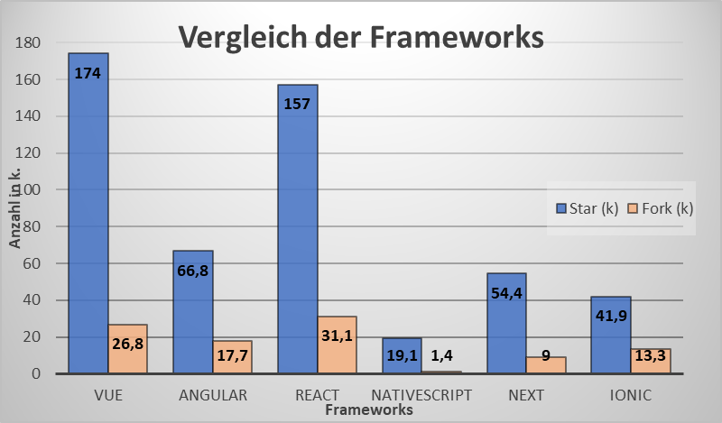

Bei den Backend Frameworks sind wir ähnlich vorgegangen. Dabei muss beachtet werden, dass NestJS grundsätzlich auf NodeJS aufbaut und dessen API verwendet, ähnlich wie Express. Letzendlich geht es bei der Wahl darum, die Alternative auszuwählen, die die Entwicklungsarbeit erleichtert bzw. verbessert. Wir haben uns die Dokumentation und den Community Support, sowie deren Reichweite, angeschaut und festgestellt, dass NestJs momentan führt. Ein Indiz dafür war auch die Anzahl der Watches bei Github, wie die untenstehende Grafik zeigt. Ein anderes Kriterium war auch die Anzahl an Forks als Indiz für den Verbesserungsbedarf des Projekts. Im Vergleich zu den anderen (NodeJS 18,2k | Express 8,4k | Deno 3,6k) hatte NestJs die kleinste Anzahl (2,8k), was die gute Qualität der vorhandenen Projekte verdeutlicht.


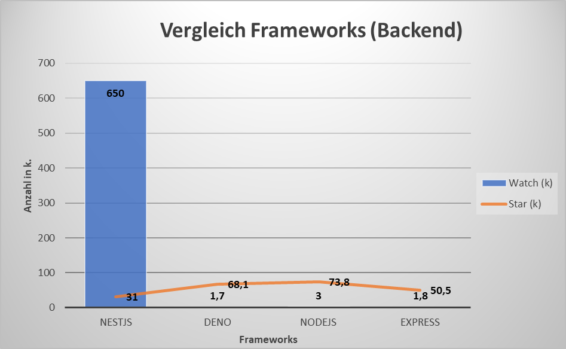

# High Level Architecture

Im Folgenden soll kurz die grobe Architektur unseres Projektes vorgestellt werden. Als Frontend-Technologie haben wir uns für Vue.js entschieden und beim Backend haben wir uns für Nest entschieden. Als Verbindung zwischen Front- und Backend fungiert Socket.io (http://socket.io/). Socket.io arbeitet mithilfe einer Message-Queue. Diese funktioniert nach dem Publish-Subscribe Pattern. Hierdurch kennen sich Sender und Empfänger nicht. Die Kommunikation erfolgt über Events, dies bietet uns eine dynamische Verbindung. Außerdem wird der Client direkt bei Updates informiert und ist so immer auf dem aktuellen Stand. Diese Socketverbindung wird erst nach erfolgreicher Anmeldung hergestellt.
Gehostet wird das Frontend von Netlify. Netlify bietet uns eine Versionskontrolle, um die App auf ältere Versionen wiederherzustellen. Außerdem managt Netlify die DNS-Einträge der Property fitnesshub.app. Darüber hinaus bietet Netlify direkt eine Continous-Integration/Continous-Delivery-Pipeline (CI/CD-Pipeline), die Änderungen im Frontendcode direkt veröffentlicht.
Auf der anderen Seite wird das Backend von Hetzner gehostet. Für das Backend haben wir eine eigene CI/CD-Pipeline mithilfe der GitHub-Actions geschrieben, dass auch die dortigen Änderungen direkt veröffentlicht werden.
Bei der Datenbank haben wir uns für die nicht-relationale (NoSQL) Datenbank MongoDB entschieden. Diese wird in der MongoDB Cloud gehostet.
Um die Verbindung zwischen dem Backend und der Datenbank herzustellen, verwenden wir das Node Module Mongoose. Dieses baut die Verbindung zwischen beiden Seiten bei Verbindungsabbrüchen wieder auf. Außerdem bietet Mongoose einen einfachen Schemenaufbau und einfaches Arbeiten mit Klassen.

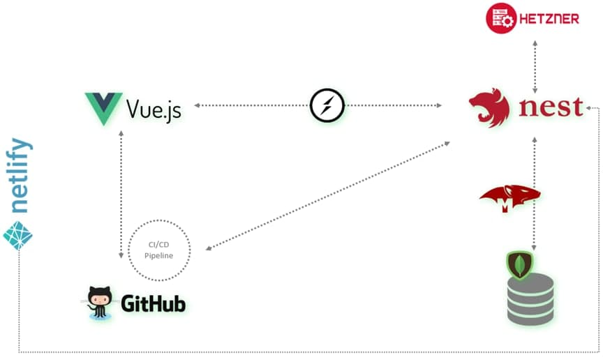

# Datenbankmodell

Im Folgenden werden die Datenbankmodelle, aufgeteilt in User, Training und Nutrition, mittels UML-Diagramme aufgezeigt. Als Datenbank wurde die dokumentenbasierte Datenbank Mongo DB verwendet.

## User

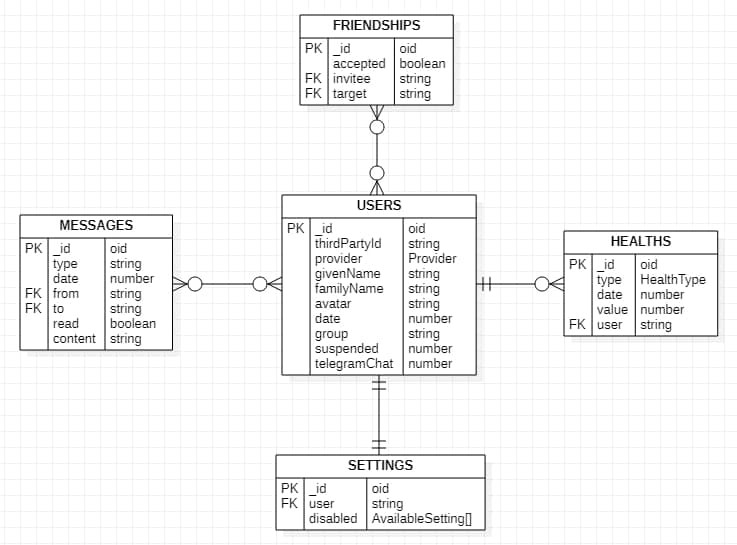

```ts
enum Provider {
    GOOGLE = 'google',
    GITHUB = 'github',
    AMAZON = 'amazon',
    ADOBE = 'adobe',
    STEAM = 'steam',
    FITBIT = 'fitbit',
}
```

```ts
enum HealthType {
    WEIGHT = 'weight',
    WATER = 'water',
    HEIGHT = 'height',
}
```

```ts
enum AvailableSetting {
    FRIENDS_RECEIVE_INVITES = 'FRIENDS_RECEIVE_INVITES',
    FRIENDS_RECEIVE_MESSAGES = 'FRIENDS_RECEIVE_MESSAGES',
    FRIENDS_RECEIVE_CHALLENGES = 'FRIENDS_RECEIVE_CHALLENGES',
    FRIENDS_SHARE_WEIGHT = 'FRIENDS_SHARE_WEIGHT',
    FRIENDS_SHARE_WATER = 'FRIENDS_SHARE_WATER',
    FRIENDS_SHARE_HEIGHT = 'FRIENDS_SHARE_HEIGHT',
    FRIENDS_SHARE_STATS = 'FRIENDS_SHARE_STATS',
    FRIENDS_SHARE_LATEST_WORKOUTS = 'FRIENDS_SHARE_LATEST_WORKOUTS',
}
```

## Training

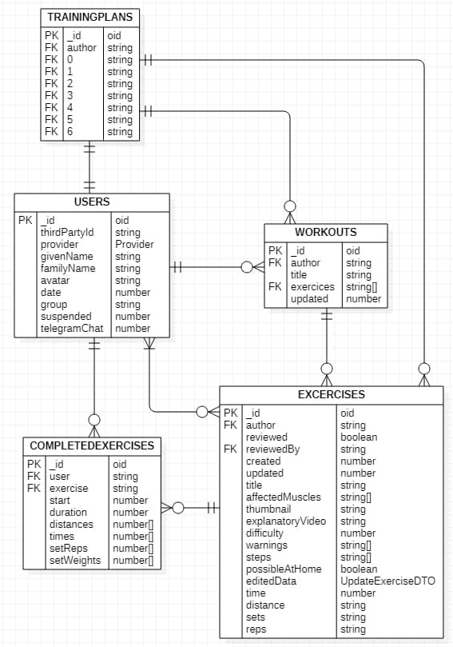

```ts
class UpdateExerciseDTO {
    readonly title?: string;
    readonly affectedMuscles?: string[];
    readonly thumbnail?: string;
    readonly explanatoryVideo?: string;
    readonly difficulty?: number;
    readonly warnings?: string[];
    readonly steps?: string[];
    readonly possibleAtHome?: boolean;
    // Variable, depending on exercise
    readonly time?: number;
    readonly distance?: string;
    readonly sets?: string;
    readonly reps?: string;
}
```

## Nutrition

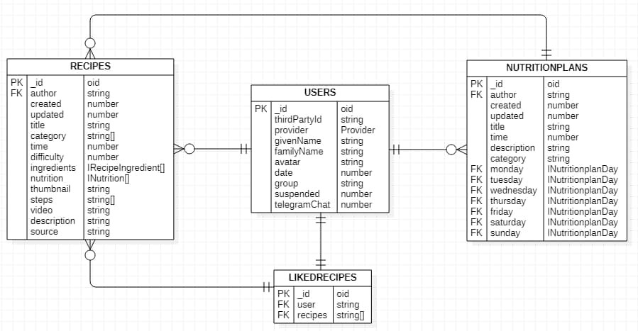

```ts
interface IRecipeIngredient {
    readonly name: string;
    readonly amount: string;
    readonly unit: string;
}
```

```ts
interface INutrition {
    readonly title: string;
    readonly amount: number;
    readonly unit: string;
}
```

```ts
interface INutritionplanDay {
    breakfast: IRecipe;
    lunch: IRecipe;
    dinner: IRecipe;
    snacks: IRecipe[];
}
```

<br />

# Unsere Highlights während der Entwicklung und Planung

* Um unser Team zu stärken und die gemeinsame Arbeit zu vertiefen, ging es auf einen Teamausflug. Von Nah und Fern verschlug es uns in das Venice Beach in den Tiefen von Käfertal. The Rock. Schweiß und Tränen wurden geschwitzt, um die FitnessHub App familiär zu gestalten und dem Anwender ein weites Spektrum an Informationen bieten zu können. Geräte wurden analysiert, Übungen auf Herz und Nieren getestet, um das Beste aus der Fitnesskategorie herauszuholen. Über 100 Bilder entstanden, die unsere Lieblingsübungen abbilden.
* Die Entwicklung der Stoppuhr und des Timers klingt einfacher als es tatsächlich ist. Einige Kleinigkeiten, wie ein einheitliches Darstellungsformat der Zahlen, vielen erst während der Entwicklung auf und mussten immer wieder angepasst werden. Jedoch ist das Endprodukt nun genau so, wie wir es uns vorgestellt haben.
* Viele Komponenten des Front- und Backends konnten während der Entwicklung einige Male wiederverwendet werden. Unser Code weist eine hohe Reusability auf, was zu einem einfacherer zu wartendem und erweiterbarem Code führt.
* Um die verschiedenen Ernährungs-, Fitness- und Muskelinhalte der App zu erstellen, konnten wir unser eigenes Know-How in diesen Themengebieten erweitern. Somit brachte die Entwicklung nicht nur Learnings in Informatikthemen, sondern auch in vielen weiteren Themengebieten mit sich.
* Die gesamte Datenbank konnte mit Mongoose über den Code strukturiert werden. So mussten Schema und Struktur nicht in der Datenbank selbst angepasst werden.
* Bei dem Aufbau der App, der Verknüpfung der Seiten und dem Einfügen verschiedener Funktionen konnte die gesamte Gruppe vom fundierten Wissen der jeweiligen Gruppenmitglieder lernen.
* Freundschaften und private Einstellungen werden mithilfe mehrerer Decorator realisiert und angezeigt. So wird noch vor dem Ausführen verschiedener Methoden geprüft, ob die bestimmten Nutzer Rechte haben sich bestimmte Inhalte anzeigen zu lassen.

# Ausblick

Während der Entwicklung kamen uns immer mehr Ideen, wie man die App verbessern oder erweitern kann. Plan war es, eine Community-Seite zu errichten, in der der Nutzer Erfolge oder Rezepte mit seinen Freunden teilen kann, sowie wir als Administratoren verschiedene Beiträge veröffentlichen können. Dieser Teil der Entwicklung fiel jedoch in den Aufgabenbereich eines Gruppenmitgliedes, welches uns im Laufe der Entwicklung leider verlassen musste. Somit wurde dieser Reiter bisher nicht realisiert und in das nächste Semester verschoben.
Eine weitere noch offene Idee waren Vorlagen für verschiedene Ernährungspläne, um den Nutzern einen Überblick geben zu können, wie beispielsweise die Ernährung für eine Woche aussehen könnte, in der man ein bestimmtes Kaloriendefizit einhält oder eine bestimmte Menge an Proteinen zu sich nimmt.
Ebenfalls geplant sind Challenges, die wir als Administratoren festlegen können, um die Mitglieder zu motivieren. Diese Challenges könnten beispielsweise so aussehen, dass die User eine Woche lang jeden Tag 50 Liegestütz machen sollen oder möglichst viele Burpees innerhalb einer Minute. Dies soll die Nutzer dazu motivieren, auch mal andere Übungen auszuprobieren und sich selber für eine kurze Zeit herauszufordern.
Auch eine Telegram Integration soll das Erhalten von Push-Benachrichtigungen ermöglichen. Da es IOS und Android uns nicht erlauben direkt auf ihre APIs zuzugreifen, da wir eine PWA entwickelt haben und keine native IOS- oder Android-App, muss diese Funktion ausgelagert werden. Auch Discord bietet seit Neustem diese Möglichkeit an. Um unser Portfolio breiter aufzustellen, werden wir so auch die Verbindung zu Discord ermöglichen.
